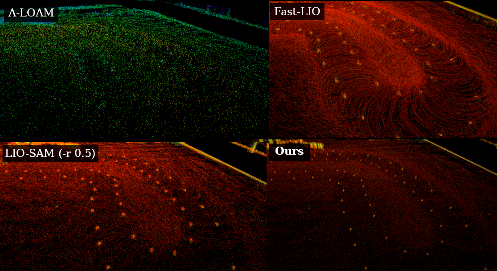

> This is a restructure/rewrite of the amazing work of Andreu Huguet. His original work canbe found at [LIMO-Velo](https://github.com/Huguet57/LIMO-Velo). More information on why this fork exists can be found in the [Motivation](#Motivation) section.

# LIMO-Velo++

## A real-time LiDAR-Inertial SLAM for high velocities in spinning LiDARs.

<p align="center">
  <br />
  Visualization of the algorithm with <code>delta = 0.01</code> (100Hz)
</p>

Designed for easy modifying via modular and easy to understand code. Relying upon [HKU-Mars](https://github.com/hku-mars)'s [IKFoM](https://github.com/hku-mars/IKFoM) and [ikd-Tree](https://github.com/hku-mars/ikd-Tree) open-source libraries. Based also on their [FAST_LIO2](https://github.com/hku-mars/FAST_LIO).

### Tested and made for racing at Formula Student Driverless
Common working speeds are 20m/s in straights and 100deg/s in the turns.

<p align="center">
  <br />
   Comparison of cones under racing speeds running all algorithms in real-time, except for LIO-SAM (-r 0.5). It failed otherwise.
</p>

# Usage

The easiest way to experiment is through the Python interface.

## Python Interface

For convinience and the ability to easily experiment with the algorithm both offline and in real time, a Python interface is provided. This interface is achived through the use of the `pybind11` library. Essentially, the C++ code is compiled into a Python module that can be imported and used in Python, ensuring that the performance of the C++ code is maintained and the same behaviour is observed.

### Installation

To install the Python interface, run the following commands:

```bash
pip install limovelo
```

### Usage

The Python interface is designed to be as simple as possible. The following is an example of how to use the Python interface:

```python
import limovelo

# Create the LIMO-Velo object
limo = limovelo.LIMO_Velo()

# Load the configuration file
limo.load_config("config.yaml")

# Load the LiDAR data
lidar_data = limovelo.LidarData()
lidar_data.load("lidar_data.bin")

# Load the IMU data
imu_data = limovelo.ImuData()
imu_data.load("imu_data.bin")
```

## C++ Library

The code is made as a C++ library, and can be used as such. Refer to the ROS2 implementation for an example of how to use the library.

## ROS2 Implementation

The ROS2 implementation is a wrapper around the C++ library, and is designed to be used in a ROS2 environment. The following is an example of how to use the ROS2 implementation:

```bash
colcon build
ros2 run limovelo limovelonode
```


# References
- [LIMO-Velo](https://github.com/Huguet57/LIMO-Velo): The official repository of LIMO-Velo from which this fork is based.
- [IKFoM](https://github.com/hku-mars/IKFoM): Iterated Kalman Filters on Manifolds
- [ikd-Tree](https://github.com/hku-mars/ikd-Tree): Incremental KD-Tree for Robotic Applications
- [FAST-LIO2](https://github.com/hku-mars/FAST_LIO): Fast and Direct LIO SLAM
